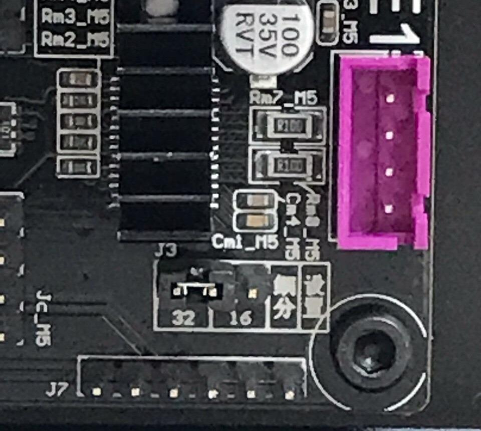

Title: Troubleshooting / General

Stepper Motor Setting on the Control Box
--------------------------------------------
Remove the screws from the Control Box, locate the connector (as pictured below), and change from position 16 to
position 32.

   

   

Change the Power PCB Board
--------------------------------
Remove the screws from the Control Box then locate and remove the screws below Power. Replace the Power PCB
Board with the new one. Pay attention with the cables, we recommend you to remove each cable separately or identify
which one goes where before removal.

   
  
